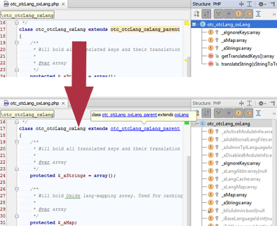

README
======================

What is OXID-Module-IDE-Helper?
-------------------------------
IDE's can't follow the module's class inheritance chain in OXID code because the referred parent classes are created in memory at runtime.
This makes it impossible for IDE's to create auto completion for the existing parent classes - the IDE simply can't know that the current class extends the other. 
This module creates the class inheritance chain and saves the missing files to disk which enables the IDE to follow the class chain. The benfit is to now have auto completion in your IDE.
After changing the module chain you should again update the parent files to make sure that the chain reflects the current inheritance chain.

Requirements
------------
You could see benefits in this module when you:
 * are a PHP developer who invents modules for OXID 
 * suffer from not having automatic code completion in your IDE
 * have installed a working OXID eShop installation version 4.9.x/5.2.x or higher
 
Installation
------------
 * copy the module folder to your OXID installation
 * log into the backend and activate the module at extensions/modules like you always do with additional modules
 * click the new menu item "DSB's IDE Helper", hover the button "create/update parent classes" and jump onto your mouse
 * in your IDE re-index the project files if necessary
 * open a module class that extends a "virtual" _parent class and praise the lord for having auto completion including the methods from parent classes

Compatibility
-------------
This module was created and tested with OXID eShop CE 4.9. Based on the functionality it provides, chances are high that it will also work smoothly in PE or EE - but it is not guaranteed. 
If you test it I'd love to get your feedback.

Example
------- 
This screenshot illustrates the effect before/after creating the parent classes.

